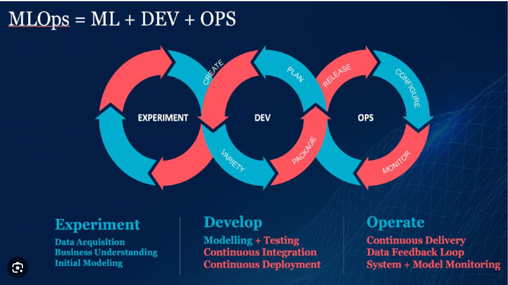
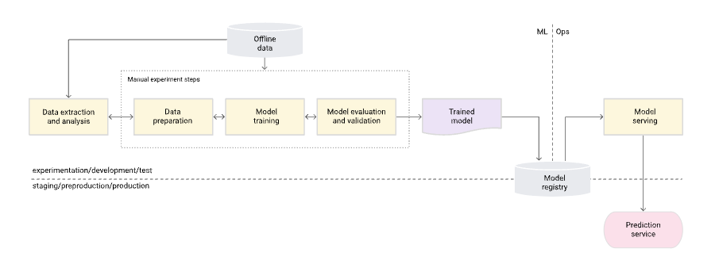
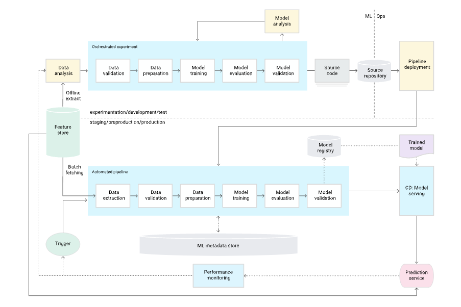
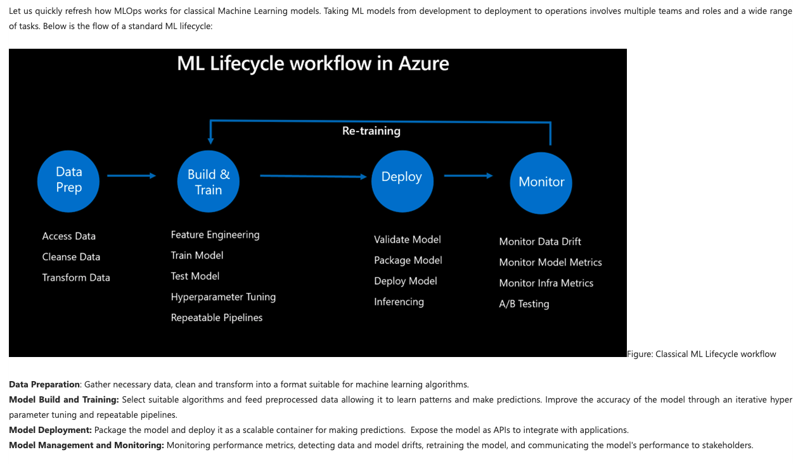
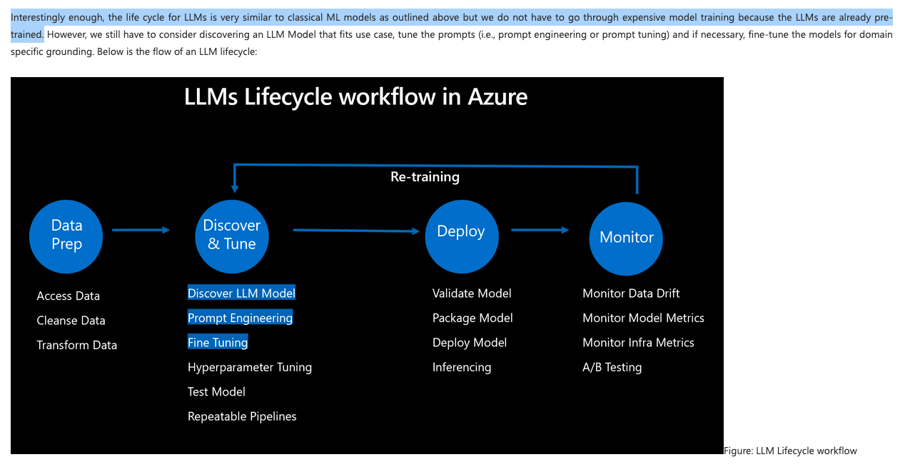

# MLOps #
MLOps consists of several teams: Data Scientists, ML Engineers etc.       
MLOps Stages are:
* Train Data Collection
* Development of ML model
* Evaluation
* Feedback
* If evaluation is successfull, deploy/store model 
* Create endpoint 
* Deploy model to endpoint
       
MLOps aims to automate repetitive tasks such as:
* Testing
* Deployments
* Monitoring       
      
## Differences between classical pipelines ##
* MLOps includes various teams such as data scientists or ML researchers etc. (Google, https://cloud.google.com/architecture/mlops-continuous-delivery-and-automation-pipelines-in-machine-learning)
* MLOps focuses on model deployment, but classical pipelines focus on software deployment (Model validation, accuracy etc.)
* MLOps includes data quality, classical pipelines are not so much
* MLOps considers dataset evolving (Google, https://cloud.google.com/architecture/mlops-continuous-delivery-and-automation-pipelines-in-machine-learning)

## LLMOps ##
LLMOps is MLOps for LLMs.      
Manage the lifecycle of LLM-powered applications, including development, deployment, and maintenance.    
      
* Instead of training model like in MLOps with huge amount of data, use zero or few-shot learning (High quality selected samples)
* Feature engineering is less important than MLOps because LLM can learn from raw data.
* In MLOps we have evaluation metrics such as accuracy, precision, recall, F1-score etc., but in LLMOps we have ROUGE, BERT, and BLEU score which focus on measuring the similarity of a response to a provided reference answer.

