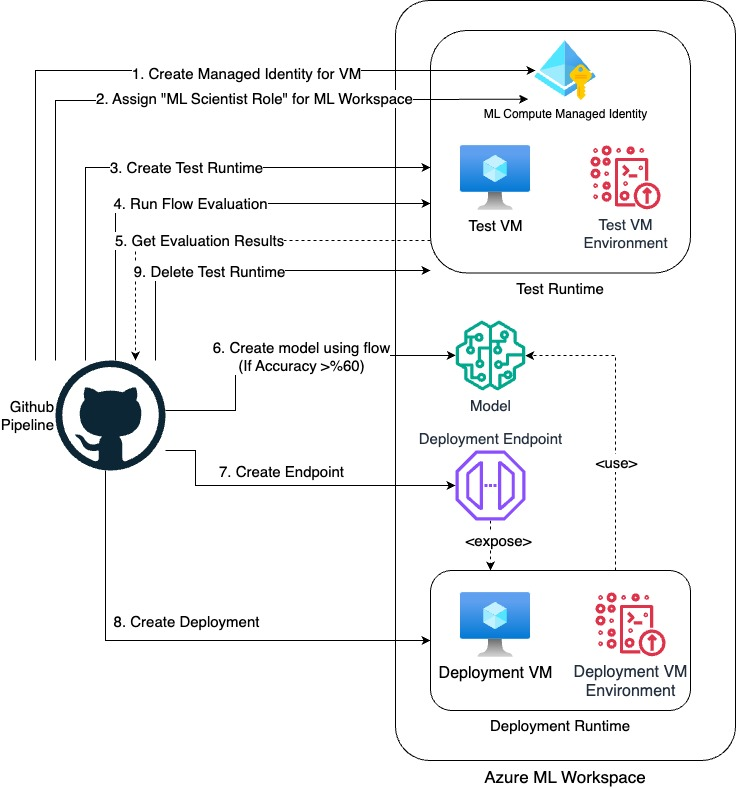
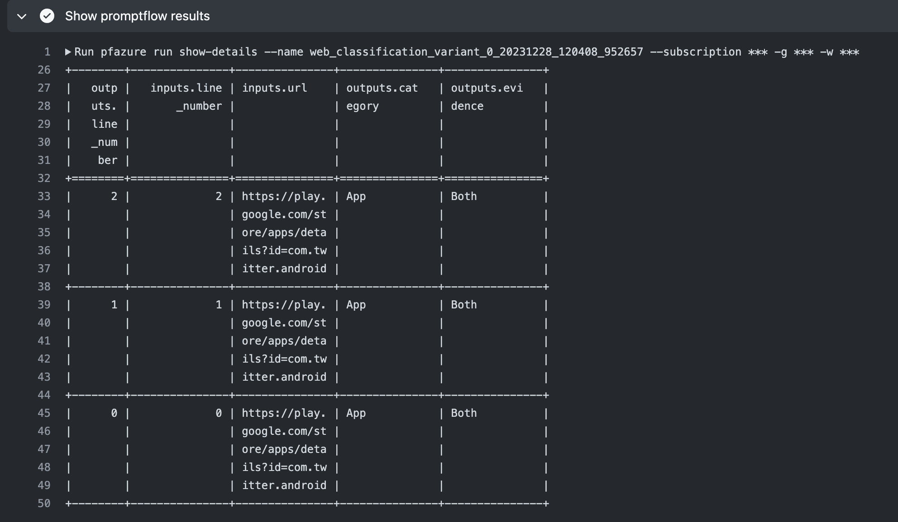

# CI/CD Pipeline for Azure ML Prompt Flow App
Jan 2024

Azure Machine Learning prompt flow (PF) is a development tool designed to streamline 
the entire development cycle of AI applications powered by Large Language Models (LLMs).     

With prompt flow, you'll be able to:
* Create executable flows that link LLMs, prompts, and Python tools through a visualized graph.
* Create prompt variants and evaluate their performance through large-scale testing.
* Deploy a real-time endpoint that allows to serve the flow as a service.

However, during Prompt Flow Application development you need to do several repeated tasks such as testing, and deployment.   
We decided to encapsulate those tasks in a CI/CD pipeline using MLOps principles.        
After modifying the prompt flow model (LLM prompts, scripts etc.), it is tested automatically. If the tests are successful, it is then deployed to the endpoint in Azure ML.      
We have used GitHub Actions for the CI/CD Pipeline.      

There are 2 jobs in the Pipeline:          
* Evaluation of the PF model
* Deployment PF model to endpoint
        
Steps which are done during **Evaluation** are:
* Initial Setup (Installing Requirements and Azure Login)
* Create Compute Instance
* Create Test Environment
* Model Testing
* Test Evaluation
* Remove Test Resources
* Endpoint Creation
* Model Deployment to the Endpoint

Steps which are done during **Deployment** are:
* Register Prompt Flow Model
* Setup Endpoint
* Check the Status of Endpoint
* Update PRT_CONFIG 
* Setup Deployment and Check Deployment Status
            
## Pre-requisites
* You need an Azure subscription. If you don’t have one, you can sign up for an account.
* Create Resource Group in your subscription.
* Create Azure AI resource in the resource group.
* GitHub Repository (You can fork sample repository from 'https://github.com/deepnetworkgmbh/PromptfFlowApplication.git').
* GitHub actions for the repository should be enabled (Go to 'settings/actions/general' and enable 'Allow all actions and reusable workflows').
* Create an Azure ML workspace under your subscription ("https://learn.microsoft.com/en-us/azure/machine-learning/quickstart-create-resources?view=azureml-api-2").
* Create a Service Principal in your subscription and assign 'Owner' role to it on the resource group (It will be used in GitHub runner to connect your account).        


## Infrastructure - CI/CD

The following figure demonstrates the steps of the CI/CD Pipeline.       
Firstly, it creates test environment and runs evaluation steps. If the accuracy of the evaluation results is above the threshold, it performs the deployment phase. The steps are detailed in the following sections.      
         
## Test Phase
In this phase, Prompt Flow model is tested and results are checked.

### 1. **Initial Setup**                      
There are several steps need to be done before the 'Test'.              
These are:       
* Install az ml extension (Required for 'ml' CLI commands) .      
* Azure login with previously Service Principal ([Created in Pre-Requirements Section](#pre-requisites)).  
* Set up Python (Python 3.11.4 is used).
* Install promptflow (Requirements in 'flow/promptflow/web-classification/requirements.txt' are used).

### 2. **Create Compute Instance**               
To run Prompt Flow Test we need to create compute instance (Virtual Machine) in Azure ML.                      
* Set Compute and Runtime Names (For further usage), they should be unique in your workspace.
* Create Managed Identity (To give required permissions to Compute Instance).   
  * `az identity create -g ${{env.GROUP}} -n ${{env.MANAGED_IDENTITY_NAME}} --query "id"`
* Assign "AzureML Data Scientist" role to MSI.
  * `az role assignment create --assignee-object-id ${{env.PRINCIPAL_ID}} --assignee-principal-type ServicePrincipal --role "AzureML Data Scientist" --scope "/subscriptions/${{env.SUBSCRIPTION}}/resourcegroups/${{env.GROUP}}/providers/Microsoft.MachineLearningServices/workspaces/${{env.WORKSPACE}}"`
* Create Azure ML Compute Instance (Used VM type is "Standard_DS1_v2", there are several options you can use) and assign the created MSI to the VM.    
  * `az ml compute create --name ${{env.COMPUTE_NAME}} --size Standard_DS1_v2 --identity-type UserAssigned --type ComputeInstance --resource-group ${{env.GROUP}} --workspace-name ${{env.WORKSPACE}} --user-assigned-identities ${{env.USER_MANAGED_ID}}`

### 3. **Create Test Environment**              
Prompt flow's runtime provides the computing resources required for the application to run, including a Docker image that contains all necessary dependency packages.
So, after creating Compute Resource, we need to create 'Test Runtime' which will run Prompt Flow Tests.
        
* We are creating Test Runtime via "POST" request to the Azure ML Workspace (Firstly create access token, and send POST request via it):         
```
access_token=$(az account get-access-token | jq -r ".accessToken")

runtime_url_post=$(echo "https://ml.azure.com/api/${{env.LOCATION}}/flow/api/subscriptions/${{env.SUBSCRIPTION}}/resourceGroups/${{env.GROUP}}/providers/Microsoft.MachineLearningServices/workspaces/${{env.WORKSPACE}}/FlowRuntimes/${{env.RUNTIME_NAME}}?asyncCall=true")
        
curl --request POST \
--url "$runtime_url_post" \
--header "Authorization: Bearer $access_token" \
--header 'Content-Type: application/json' \
--data "{
\"runtimeType\": \"ComputeInstance\",
\"computeInstanceName\": \"${{env.COMPUTE_NAME}}\",
}"
```
            
* Runtime creation takes some time (About 5 minutes), so we are using ping mechanism to be sure runtime is ready ("GET" request is sent at each 100s):                
```         
http_response="Unavailable"
while : ; do
  echo "Waiting runtime... 1"
  if [ "$http_response" = "null" ]; then
      echo "Exiting from the while loop..."
      break
  fi
  runtime_url_get=$(echo "https://ml.azure.com/api/${{env.LOCATION}}/flow/api/subscriptions/${{env.SUBSCRIPTION}}/resourceGroups/${{env.GROUP}}/providers/Microsoft.MachineLearningServices/workspaces/${{env.WORKSPACE}}/FlowRuntimes/${{env.RUNTIME_NAME}}")
  http_response=$(curl --request GET \
    --url "$runtime_url_get" \
    --header "Authorization: Bearer $access_token" \
    | jq -r '.status')
  echo "Waiting runtime... 2"
  echo $http_response
  sleep 500
done
```          
When Runtime is ready, Pipeline will continue with next step.       

### 4. **Model Testing**
We have 2 tests in the project:        
* **flow/promptflow/web-classification/run.yml**: Running just Prompt Flow to determine possible errors in the Flow.
* **flow/promptflow/web-classification/run_evaluation.yml**: Evaluating Model with ground truths.         
        
Example output of the test is below:      
       
       
**You can also add more test data to the 'flow/promptflow/web-classification/data.jsonl' file.**   

### 5. **Test Evaluation**
After running tests on the Prompt Flow Model, we evaluate results. 
To do that, we created Evaluation Script ('flow/promptflow/llmops-helper/assert.py').     
It takes the output of previous step ("4. Model Testing"), and calculate accuracy.     
* If accuracy is higher than 60% (Can be adjusted), then set 'evaluation' job's result variable ('eval_result') True.
* Otherwise: set it False.          

### 6. **Remove Test Resources**      
Finally, we remove Compute Instance which is created during Test Phase.
       
## Deployment Phase
If **eval_result** variable is set to 'True' in the Test Phase, Pipeline will continue with Deployment Phase.           
Otherwise, we do not deploy/publish model with endpoint to the users.   

As Jobs work on different Virtual Machines in GitHub Actions environment, we first need to execute all prerequisite steps.     
That steps are the same as [Initial Setup in the Test Phase](#1-initial-setup).           
Afterwards, steps are:    

### 1. **Register Prompt Flow Model**        
After Testing, model should be stored in Azure ML Studio.      
To do that, model file 'flow/promptflow/deployment/model.yaml' is used.
```
az ml model create --file flow/promptflow/deployment/model.yaml  -g *** -w ***
```
       
### 2. **Setup Endpoint**
We create an endpoint to deploy the saved model and handle user requests that come into the application.      
Again, we are using Azure CLI commands and endpoint yaml ('flow/promptflow/deployment/endpoint.yaml').         
```
az ml online-endpoint create --file flow/promptflow/deployment/endpoint.yaml  --name ${{env.ENDPOINT_NAME}} -g ${{env.GROUP}} -w ${{env.WORKSPACE}}
```

### 3. **Check the Status of Endpoint**
After creating endpoint, checking its status via `az ml online-endpoint show -n demo-endpoint -g *** -w ***` command.

### 4. **Update PRT_CONFIG**      
If our endpoint is running we are changing 'PRT_CONFIG' variable in the 'deployment.yaml' configuration.      
'PRT_CONFIG' is used to connect OpenAI (Connection and Deployments) and our Prompt Flow App.          
You do not need to add something here, with pipeline it will automatically change 'PRT_CONFIG' with your OpenAI Deployment's description as below:     
```
PRT_CONFIG_OVERRIDE=deployment.subscription_id=${{ env.SUBSCRIPTION }},deployment.resource_group=${{ env.GROUP }},deployment.workspace_name=${{ env.WORKSPACE }},deployment.endpoint_name=${{ env.ENDPOINT_NAME }},deployment.deployment_name=${{ env.DEPLOYMENT_NAME }}
```          

### 5. **Setup Deployment and Check Deployment Status**
Finally, its ready to deploy model to the endpoint.       
For this purpose, the 'flow/promptflow/deployment/deployment.yaml' file is used.      
```
az ml online-deployment create --file flow/promptflow/deployment/deployment.yaml --endpoint-name ${{env.ENDPOINT_NAME}} --all-traffic -g ${{env.GROUP}} -w ${{env.WORKSPACE}}
```    
        
# Conclusion
Azure Prompt Flow is helpful service to develop application which interacts with LLM models.         
The project explained the use of Pipeline to automate repetitive tasks while developing Prompt Flow Application.     
           
# References
https://learn.microsoft.com/en-us/azure/machine-learning/prompt-flow/overview-what-is-prompt-flow?view=azureml-api-2
https://www.databricks.com/glossary/mlops
https://cloud.google.com/architecture/mlops-continuous-delivery-and-automation-pipelines-in-machine-learning
https://www.youtube.com/watch?v=j0YJ3BZjrFs
https://github.com/MG-Microsoft/LLMOps-PF.git


