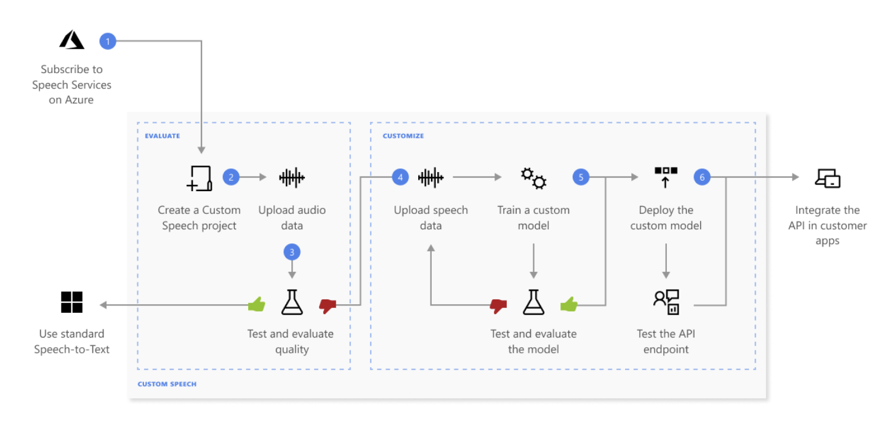
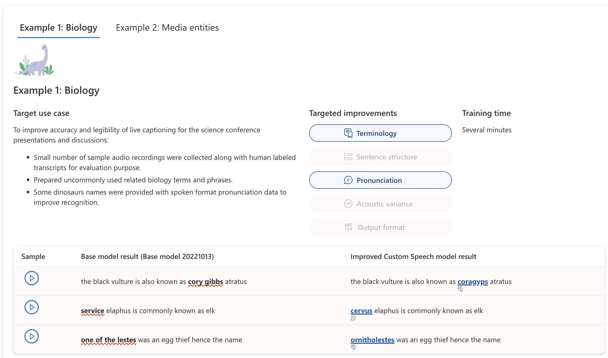

# Azure Speech Service #
The Speech service provides speech to text and text to speech capabilities with a Speech resource.          
**Microsoft uses Speech for many scenarios, such as captioning in Teams, dictation in Office 365, and Read Aloud in the Edge browser.**
* Speech to text
* Diarization
* Transcriptions, captions, or subtitles for live meetings
* Speech translation
* Language identification

Two types of translation:
* Real-time speech to text
    * With real-time speech to text, the audio is transcribed as speech is recognized from a microphone or file.
    * Transcriptions, captions, or subtitles for live meetings
* Batch transcription
    * Used to transcribe a large amount of audio in storage.
    * You submit the audio data, and then retrieve transcription results asynchronously.
    * The service transcribes the audio data and stores the results in a storage container.

Two types of language detection mechanisms:
* **At-start Language identification (LID):** Identifies the language once within the first few seconds of audio.
  Use at-start LID if the language in the audio won't change.
  With at-start LID, a single language is detected and returned in less than 5 seconds.

* **Continuous LID:** Can identify multiple languages for the duration of the audio.
  Use continuous LID if the language in the audio could change.
  Continuous LID doesn't support changing languages within the same sentence.
  For example, if you're primarily speaking Spanish and insert some English words, it will not detect the language change per word.

## Create Custom Model for Azure Speech Service ##
Speech recognition utilizes a Universal Language Model as a base model that is trained with Microsoft-owned data and reflects commonly used spoken language.
When you make a speech recognition request, the most recent base model for each supported language is used by default.
A custom model can be used to augment the base model to improve recognition of domain-specific vocabulary specific to the application by providing text data to train the model.

