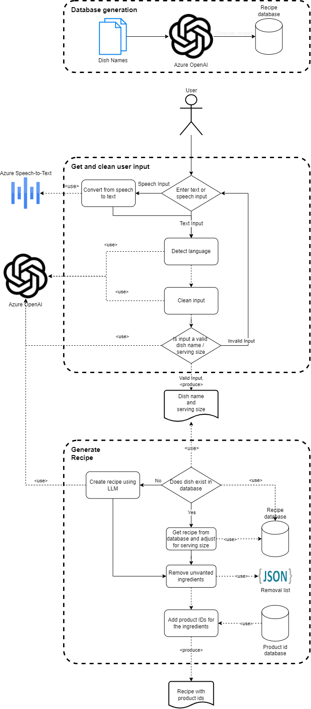

# Recipe Generator
The goal of this repository is to generate cooking recipes from a user input and then associate each ingredient of that
recipe with a product in a product database. This is demonstrated in the following diagram.

## Prerequisites
The application depends on Azure OpenAI deployment. Therefore, you need to set the `AZURE_OPENAI_API_KEY` and the
`AZURE_OPENAI_ENDPOINT` environment variables accordingly. The values can be found in the "Key and Endpoint" section
of your Azure OpenAI resource.
The application also needs the deployment name as the `AZURE_OPENAI_GPT_DEPLOYMENT` environment variable. It the deployment
name in your Azure OpenAI instance that has a GPT-3.5 or GPT-4 model.

## Using the Application
The `recipe_generator.py` script is the entry-point of the application. 
Frist script will ask user to choose one of the input options ('Speech' or 'Text'). 3 languages (English, German and Turkish) are supported for Speech option.
You can enter any language for text option. You can give sentence as input for both dish name and serving count, such as 'I want to cook pizza'.
System will get exact dish name from the sentence. 

## Creating/Updating the Recipe Database
The application uses the `data/new-recipe-db.json` file as the recipe database. It is created using the `data/existing-recipes-db.json`.
The `recipe_db_generator.py` script uses LLM to convert from the existing db to the new db format.
We kept existing db and the script to showcase the possibility of converting any existing recipe db to the required format.

The script takes a list of recipe names from an already existing recipe database and generates recipes for them.
There is a *NUMBER_OF_RECIPES* variable in the script that determines how many recipes to generate. We kept it low for
minimizing the cost.
