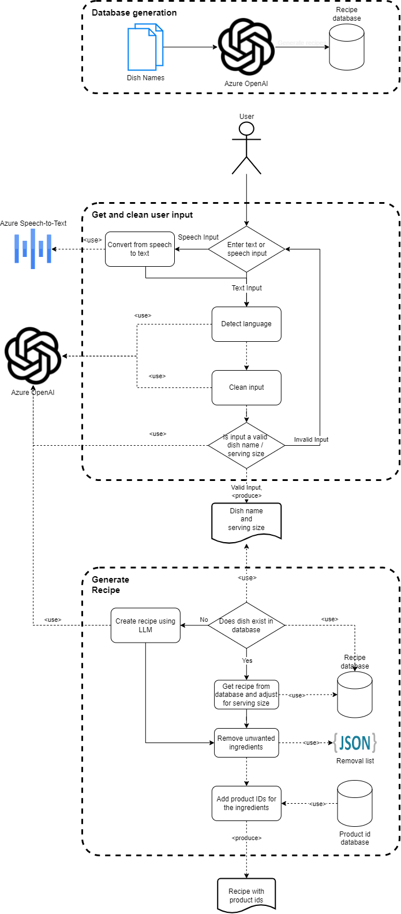

# Recipe Generator
The goal of this module is to generate the ingredients for a recipe using user input.
It associates each ingredient of the recipe with a product in a product database. Therefore, the result can be integrated
into other services, such as putting the resulting ingredients list can be added to the user's basket.

The flow-chart of the system is presented in the following diagram:

## Prerequisites
### Environment Variables:
  * `AZURE_OPENAI_API_KEY`
  * `AZURE_OPENAI_ENDPOINT`
  * `AZURE_OPENAI_GPT_DEPLOYMENT`
  * `SPT_API_KEY`
  * `SPT_REGION`

The application depends on Azure OpenAI deployment. Therefore, you need to set the `AZURE_OPENAI_API_KEY` and the
`AZURE_OPENAI_ENDPOINT` environment variables accordingly. The values can be found in the "Key and Endpoint" section
of your Azure OpenAI resource.
The application also needs the deployment name as the `AZURE_OPENAI_GPT_DEPLOYMENT` environment variable. It the deployment
name in your Azure OpenAI instance that has a GPT-3.5 or GPT-4 model.

The application includes speech-to-text function. It uses Azure AI Speech service. Once the service is created, please 
set the `SPT_API_KEY` and `SPT_REGION` environment variables that you can get the values from the Keys and Endpoints page
of the service.

## Using the Application
The `main.py` script is the entry-point of the application. It does not require any arguments. 

The script asks user to choose one of the input options ('Speech' or 'Text'). 
For the "Speech" option, three languages (English, German and Turkish) are supported. 
For the "Text" option, you can enter text in any language. 
The inputs do not need to be clean. i.e. you can give sentence as input for both dish name and serving count, 
such as 'I want to cook pizza'; system will extract dish name from the sentence.

Once the inputs are acquired, it searches within the recipe db. 
If the recipe does not exist in the db, it generates the recipe using Azure OpenAI. 

Subsequently, it adjusts the ingredients quantity to the servings size accordingly. 
Finally, it returns the ingredients as json.

## Ingredients to Recipe
The `ingredients_to_recipe.py` script provides a different way to interact with our recipe generation application.
It allows users to find a dish they can make with mostly using ingredients they already have at their home.

The LLM asks questions to the user to understand their preferences.
It offers them a dish option based on those preferences and the ingredients they currently have.
When the user is satisfied with the dish option that the LLM has come up with,
a full recipe for this dish is generated using the `RecipeGenerator` class.
Once the recipe is generated, the missing ingredients for the recipe are presented to the user as a list.

## Creating/Updating the Recipe Database
The application uses the `data/new-recipe-db.json` file as the recipe database. It is created using the `data/existing-recipes-db.json`.
The `recipe_db_generator.py` script uses LLM to convert from the existing db to the new db format.
We kept existing db and the script to showcase the possibility of converting any existing recipe db to the required format.

The script takes a list of recipe names from an already existing recipe database and generates recipes for them.
There is a *NUMBER_OF_RECIPES* variable in the script that determines how many recipes to generate. We kept it low for
minimizing the cost.
